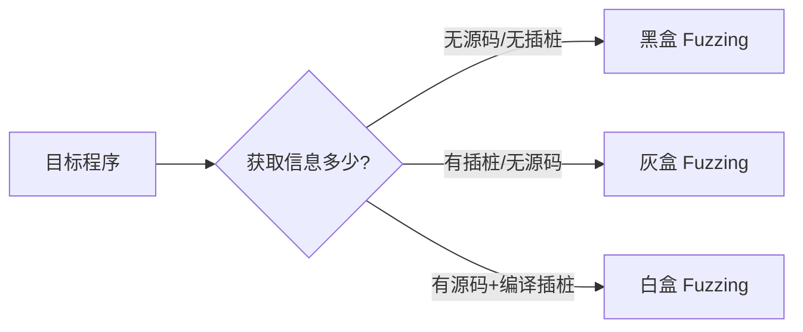

# 第8章：Fuzzing 技术

难度：⭐⭐⭐  
预计时间：90分钟

---

## 学习目标和本章提纲

在本章结束后，你将能够：

- 理解 Fuzzing 的核心原理与发展历程
- 掌握 AFL/AFL++ 的工作机制与实战使用
- 使用 libFuzzer 和 Honggfuzz 进行覆盖率引导的模糊测试
- 设计结构化的 Fuzzing 方案（自定义 mutator）
- 对 Crash 进行分类、去重与最小化
- 设计完整的 Fuzzing Campaign 并应用于真实漏洞挖掘

---

## 8.1 Fuzzing 基础

### 8.1.1 什么是 Fuzzing

Fuzzing（模糊测试）是一种自动化软件测试技术，通过向目标程序输入大量非预期、随机或半随机的数据（称为"Fuzz"），观察程序是否出现崩溃、断言失败、内存泄漏等异常行为，从而发现潜在的安全漏洞。

> **核心思想**：与其手工构造完美的测试用例，不如让计算机自动生成数以万计的"奇怪"输入，用统计学的方法覆盖更多代码路径。

Fuzzing 的优势在于：

- **低门槛**：不需要源代码（黑盒 Fuzzing）
- **高自动化**：可以 7×24 小时无人值守运行
- **高产出**：已在 Linux 内核、Chrome、FFmpeg 等大型项目中发现数千个漏洞

### 8.1.2 发展历史

Fuzzing 的发展可以分为三个时代：

| 时代 | 年份 | 代表人物/工具 | 核心贡献 |
|------|------|--------------|----------|
| 萌芽期 | 1988 | Barton Miller | 首次系统性提出 Fuzzing 概念，针对 Unix 工具测试 |
| 成长期 | 1990s–2000s | PROTOS、Peach | 引入协议感知、基于语法的 Fuzzing |
| 爆发期 | 2013–至今 | AFL、libFuzzer、AFL++ | 覆盖率引导（Coverage-Guided）革命 |

**1988 年**：威斯康星大学的 Barton Miller 教授在冬季暴风雪期间，发现通过随机输入测试 Unix 命令行工具可以稳定触发崩溃，发表了开创性论文《An Empirical Study of the Reliability of UNIX Utilities》，标志着 Fuzzing 的诞生。

**2000 年代**：出现了基于生成（Generation-based）和基于变异（Mutation-based）的两大类 Fuzzing 方法。Peach Fuzzer 等工具引入了数据模型（Data Model）概念，可以针对特定协议（如 HTTP、SIP）生成结构化输入。

**2013 年**：Michał Zalewski（lcamtuf）发布了 AFL（American Fuzzy Lop），首次将**覆盖率引导**思想大规模实用化，使得 Fuzzer 能够智能地选择能够触发新代码路径的输入进行变异，Fuzzing 效率得到了质的飞跃。

**2017 年后**：AFL++ 项目成立，集成了社区的大量改进；libFuzzer 与 Sanitizer 工具链深度融合；Google 的 OSS-Fuzz 平台持续为开源软件提供免费的 Fuzzing 服务。

### 8.1.3 黑盒、灰盒与白盒 Fuzzing 对比



| 维度 | 黑盒 Fuzzing | 灰盒 Fuzzing | 白盒 Fuzzing |
|------|-------------|-------------|-------------|
| 源代码 | 不需要 | 不需要 | 需要 |
| 插桩 | 无 | 二进制插桩（如 QEMU） | 编译期插桩（如 AFL-gcc） |
| 覆盖率反馈 | 无 | 有（通过插桩获取） | 有（精确） |
| 速度 | 快 | 中 | 慢（编译开销） |
| 代表工具 | Peach、Sulley | AFL-QEMU、AFL++（QEMU 模式） | AFL、libFuzzer |
| 适用场景 | 闭源软件、网络协议 | 无源码但可运行的目标 | 开源软件、可编译目标 |

!!! tip "实战建议"
    对于开源项目，优先使用白盒 Fuzzing（AFL++/libFuzzer）；对于闭源二进制，使用灰盒 Fuzzing（AFL++ 的 QEMU 模式或 Frida 模式）。

### 8.1.4 覆盖率引导原理

覆盖率引导（Coverage-Guided Fuzzing）是现代 Fuzzer 的核心。其基本思想是：

1. **插桩（Instrumentation）**：在编译阶段或运行时，在程序的每个基本块（Basic Block）边界插入记录代码，用于记录"哪些代码被执行了"
2. **位图（Bitmap）**：AFL 使用一个 64KB 的全局数组 `trace_bits` 作为覆盖率记录区。每当执行从一个基本块跳转到另一个基本块时，用 `(prev_block_id >> 1) ^ cur_block_id` 计算索引，在 bitmap 中对应位置加 1
3. **新颖性判断**：每次运行一个测试用例后，检查 bitmap 中是否有新的位置被置位（即发现了新的边/Edge）。如果有，则将该测试用例加入"感兴趣队列"（Interesting Queue）
4. **能量调度（Power Schedule）**：对不同测试用例分配不同的"能量"（即变异次数），优先对覆盖率增长快的种子进行更多变异

```c
// AFL 插桩后的简化逻辑
void __afl_maybe_log(unsigned int cur_loc) {
    unsigned int prev_loc = __afl_prev_loc;
    __afl_prev_loc = cur_loc >> 1;
    unsigned int idx = prev_loc ^ cur_loc;  // 计算边的标识符
    __afl_area_ptr[idx]++;                  // bitmap 对应位置 +1
}
```

!!! info "边覆盖 vs 块覆盖"
    - **块覆盖（Block Coverage）**：只记录"哪些基本块被执行过"，无法区分 `A→B` 和 `A→C` 是两条不同的路径
    - **边覆盖（Edge Coverage）**：记录"从哪里跳转到哪里"，能够区分不同的控制流路径，是 AFL 采用的方案
    - **路径覆盖（Path Coverage）**：记录完整执行路径（如 A→B→D 和 A→C→D 是不同路径），表达能力最强但开销也最大

---

## 8.2 AFL/AFL++ 详解

### 8.2.1 AFL 工作原理

AFL（American Fuzzy Lop）的核心架构包含以下几个关键组件：

#### Fork Server 机制

传统的 Fuzzing 方式每次运行目标程序都需要 `fork()` + `exec()`，而 `exec()` 的系统调用开销非常大。AFL 创新地引入了 **Fork Server** 机制：

1. AFL 启动目标程序时，目标程序在 main 函数之前（通过插桩代码）暂停，等待 AFL 的指令
2. 每当 AFL 需要运行一个测试用例时，通过 `fork()` 创建一个子进程（不需要 `exec()`）
3. 子进程继续运行目标程序，父进程（Fork Server）继续等待下一个测试请求

```c
// Fork Server 的简化逻辑（插桩代码中）
void __afl_forkserver(void) {
    // 向 AFL 报告 Fork Server 已就绪
    write(status_pipe, &ok, 4);
    
    while (1) {
        // 等待 AFL 发来"开始下一个测试"的信号
        read(control_pipe, &was_killed, 4);
        
        pid_t child_pid = fork();
        if (child_pid == 0) {
            // 子进程：继续执行目标程序
            return;
        }
        
        // 父进程：向 AFL 报告子进程 PID，然后继续等待
        write(status_pipe, &child_pid, 4);
        waitpid(child_pid, &status, 0);
    }
}
```

Fork Server 的好处是：避免了重复的 `exec()` 系统调用，使得 AFL 的用例执行速度可以达到每秒数千次甚至上万个用例。

#### Bitmap 与覆盖率记录

AFL 的 bitmap 是一个 64KB 的数组（`uint8_t trace_bits[65536]`），用于记录边覆盖信息：

- 每个边的 ID 通过 `(prev_block >> 1) ^ cur_block` 计算，范围在 0～65535
- 每次执行一个测试用例后，AFL 检查 bitmap 中哪些位置从 0 变成了 1（表示该边第一次被执行）
- 如果某个位置的值从 1 增长到了 2～255，表示这条边被执行了多次，但 AFL 默认不将其视为"新覆盖"（可通过 `-b` 参数调整）

!!! note "为什么是 64KB？"
    64KB 是一个工程上的权衡：太小会导致哈希冲突（不同边映射到同一位置），太大会增加内存开销和检查时间。在实践中，64KB 对于大多数程序已经足够。

#### 变异策略

AFL 的变异策略分为两类：

**确定性变异（Deterministic Mutation）**：

- **位翻转（Bitflip）**：逐位、逐字节、逐字、逐双字翻转
- **算术变异（Arithmetic）**：对整数进行加/减操作（小范围）
- **兴趣值替换（Interest）**：用一组"有趣"的值（如 0, 1, INT_MAX, -1 等）替换原值
- **字典替换（Dictionary）**：用用户提供的字典中的 token 进行替换

**非确定性变异（Havoc）**：

- 随机组合多种变异操作（删除、插入、重叠、拼接等）
- 变异幅度更大，但效率较低
- 对新发现的种子，AFL 会先进行确定性变异，再进入 Havoc 阶段

### 8.2.2 AFL++ 增强功能

AFL++ 是 AFL 的社区增强版，集成了大量改进：

| 功能 | 说明 |
|------|------|
| **更多编译模式** | 支持 GCC 插件插桩、LLVM 插桩、QEMU 模式、Frida 模式、CoreSight 模式（ARM 硬件追踪） |
| **更好的变异策略** | 集成 MOpt、RADAMSA、RedQueen 等先进变异算法 |
| **自定义 Mutator API** | 允许用户编写自定义变异函数（C/Rust/Python） |
| **并行 Fuzzing** | 原生支持多核并行（`-M` 主实例 + `-S` 从实例） |
| **Crash 去重** | 内置 `afl-cmin` 和 `afl-tmin` 工具 |
| **更好的 UI** | 实时显示更多统计信息（pending 队列、覆盖率曲线等） |
| **CMPLOG 模式** | 通过比较指令日志记录，引导 Fuzzer 更智能地生成能绕过比较指令的输入 |

#### 安装 AFL++

```bash
# 克隆 AFL++ 仓库
git clone https://github.com/AFLplusplus/AFLplusplus.git
cd AFLplusplus

# 编译并安装
make all
sudo make install

# 验证安装
afl-fuzz --version
```

### 8.2.3 完整使用流程

下面以 FFmpeg 的 `ffmpeg` 命令为例，演示 AFL++ 的完整使用流程。

#### 步骤 1：编译目标程序

```bash
# 使用 afl-gcc 或 afl-clang 编译（源码可用时）
CC=afl-clang-fast CXX=afl-clang-fast++ ./configure --disable-shared
make clean
make -j$(nproc)

# 如果使用 CMake
CC=afl-clang-fast CXX=afl-clang-fast++ cmake ..
make -j$(nproc)
```

!!! warning "注意事项"
    - 编译时建议加上 `-g` 选项（保留调试符号），方便后续 Crash 分析
    - 可以配合 AddressSanitizer（ASAN）使用：`CC="afl-clang-fast -fsanitize=address"`

#### 步骤 2：准备初始语料库

```bash
# 创建一个初始语料库目录，放入一些合法的输入文件
mkdir input_corpus
cp /path/to/valid_samples/*.mp4 input_corpus/
cp /path/to/valid_samples/*.avi input_corpus/

# 可以用 afl-cmin 对初始语料库进行最小化（去除冗余文件）
afl-cmin -i input_corpus -o input_corpus_min -- ./ffmpeg -i @@ -f null -
```

#### 步骤 3：运行 AFL++

```bash
# 基本运行命令
afl-fuzz -i input_corpus_min -o output_dir -- ./ffmpeg -i @@ -f null -

# 常用参数说明：
# -i：输入语料库目录
# -o：输出目录（将包含 queue/、crashes/、hangs/ 等子目录）
# @@：占位符，表示 AFL 会将其替换为实际的测试用例路径
# -m none：不限制内存（调试 ASAN 时常用）
# -t 1000：设置超时时间为 1000ms
# -M master：主实例（并行 Fuzzing 时）
# -S slave1：从实例（并行 Fuzzing 时）
```

#### 步骤 4：监控 Fuzzing 进度

AFL++ 运行时会显示一个实时 UI：

```
  +----------------------------------------------------+
  |  AFL++ 4.00c  |  x86_64  |  Linux 5.15          |
  +----------------------------------------------------+
  |  cycles done : 0          |  map density : 35.2%  |
  |  corpus count : 342       |  count cover : 12.3k  |
  |  pending : 18             |  saved crashes : 3    |
  |  throughput : 234.5/sec   |  saved hangs : 0      |
  +----------------------------------------------------+
```

关键指标解读：

- **cycles done**：Fuzzer 完成对所有种子的完整变异轮次次数。当 cycles done > 1 时，说明语料库相对稳定
- **pending**：待处理的种子数量。如果 pending 长期很高，说明 Fuzzer 在不断发现新路径
- **map density**：bitmap 的利用率。如果长期低于 10%，说明插桩可能不充分
- **throughput**：每秒执行的用例数。低于 100 可能需要优化

### 8.2.4 Crash 分析

当 AFL 发现 Crash 后，会将其保存在 `output_dir/default/crashes/` 目录下，文件名为 `id:xxxxx,sig:xx,src:xxxxx,...`。

#### 使用 afl-tmin 最小化 Crash 样本

Crash 样本往往很大，且包含大量与触发 Crash 无关的数据。使用 `afl-tmin` 可以将其最小化：

```bash
# 最小化单个 Crash 样本
afl-tmin -i output_dir/default/crashes/id:000001,sig:11,src:001234 \
         -o minimized_crash.bin -- ./ffmpeg -i @@ -f null -

# 最小化后，用 gdb 加载分析
gdb --args ./ffmpeg -i minimized_crash.bin -f null -
```

#### 使用 GDB 调试 Crash

```gdb
# 在 GDB 中运行目标程序
(gdb) run

# 程序崩溃后，查看 backtrace
(gdb) bt
# 示例输出：
# #0  0x7ffff7a12b2d in av_free() from libavutil.so
# #1  0x7ffff7b34c01 in av_frame_unref() from libavutil.so
# #2  0x5555556789ab in decode_frame() at decode.c:1234

# 查看崩溃位置的寄存器状态
(gdb) info registers

# 查看崩溃地址附近的内存
(gdb) x/20x $pc

# 查看导致崩溃的具体指令
(gdb) disassemble $pc
```

!!! tip "配合 AddressSanitizer"
    如果在编译时启用了 ASAN（`-fsanitize=address`），Crash 时会输出详细的内存错误报告（如堆溢出、UAF 的具体位置和类型），大大加速分析过程。

---

## 8.3 libFuzzer 与 Honggfuzz

### 8.3.1 libFuzzer 使用

libFuzzer 是 LLVM 项目的一部分，是一个**进程内（in-process）**的覆盖率引导 Fuzzer。与 AFL 的 Fork 模式不同，libFuzzer 将 Fuzzer 逻辑与被测代码链接在同一个进程中，通过回调函数 `LLVMFuzzerTestOneInput` 不断向目标代码提供输入。

#### 编写 libFuzzer 测试用例

```c
// fuzzer_target.c
#include <stdint.h>
#include <stddef.h>
#include <string.h>
#include <stdlib.h>

// 被测函数（示例：解析一个简化的 PNG 头部）
int parse_png_header(const uint8_t *data, size_t size) {
    if (size < 8) return -1;
    
    // 检查 PNG 签名
    const uint8_t png_sig[8] = {137, 80, 78, 71, 13, 10, 26, 10};
    if (memcmp(data, png_sig, 8) != 0) return -1;
    
    // 模拟解析 PNG 数据块（故意留一个堆溢出漏洞）
    uint8_t *buf = (uint8_t*)malloc(64);
    if (size > 64) {
        memcpy(buf, data + 8, 64);  // 漏洞：未检查 size-8 是否超过 64
    }
    free(buf);
    return 0;
}

// libFuzzer 入口函数
extern "C" int LLVMFuzzerTestOneInput(const uint8_t *data, size_t size) {
    parse_png_header(data, size);
    return 0;
}
```

#### 编译与运行

```bash
# 使用 Clang 编译，启用 libFuzzer 和 AddressSanitizer
clang -g -fsanitize=fuzzer,address fuzzer_target.c -o fuzzer_target

# 运行 Fuzzer
./fuzzer_target -max_total_time=3600 -max_len=4096

# 常用参数：
# -max_total_time=N：运行 N 秒后停止
# -max_len=N：输入的最大长度
# -runs=N：执行 N 个用例后停止
# -corpus=dir：指定/保存语料库目录
# -print_coverage：打印覆盖率统计
# -help：查看所有参数
```

libFuzzer 的输出示例：

```
#1000123  NEW    cov: 1234 ft: 5678 corp: 89 exec/s: 1234 rss: 64Mb L: 256/4096 MS: 3 ChangeBit-InsertByte-CrossOver
```

- `NEW`：发现了新的覆盖
- `cov`：当前覆盖的边数量
- `corp`：语料库中的种子数量
- `exec/s`：每秒执行次数

### 8.3.2 与 AFL 对比

| 维度 | AFL/AFL++ | libFuzzer |
|------|-----------|-----------|
| 架构 | 进程外（out-of-process），通过 fork 运行 | 进程内（in-process），链接到同一二进制 |
| 速度 | 较慢（fork 开销） | 很快（无 fork 开销） |
| 需要源代码 | 否（可用 QEMU 模式） | 是（需要与目标代码链接） |
| 并行支持 | 原生支持（-M/-S） | 需要外部编排（如 OSS-Fuzz） |
| 崩溃复现 | 直接运行 `./target < crash_file` | 需要保存语料库，用相同二进制复现 |
| 与 Sanitizer 集成 | 需单独编译 | 天然集成（编译时加 `-fsanitize=address`） |
| 适合场景 | 黑盒/灰盒测试、大型现有程序 | 白盒测试、库函数测试 |

!!! info "Google 的实践"
    Google 的 OSS-Fuzz 平台同时支持 AFL 和 libFuzzer，并且会自动将两者的语料库进行交叉融合（libFuzzer 发现的种子可以给 AFL 用，反之亦然）。

### 8.3.3 Honggfuzz 特点

Honggfuzz 是另一个强大的覆盖率引导 Fuzzer，由 Google 的 Robert Święcki 开发。其特点包括：

1. **多架构支持**：原生支持 x86、x86_64、ARM、AArch64、MIPS、PowerPC 等
2. **硬件支持的覆盖率收集**：在支持 Intel PT（Processor Trace）或 ARM CoreSight 的 CPU 上，可以直接通过硬件追踪获取覆盖率，不需要软件插桩
3. **与 Sanitizer 深度集成**：可以自动捕获 AddressSanitizer、UndefinedBehaviorSanitizer、MemorySanitizer 等报告
4. **支持持久模式（Persistent Mode）**：类似 libFuzzer 的进程内 Fuzzing，通过在目标代码中插入 `HF_ITER` 宏实现
5. **内置 Crash 分析**：可以自动对 Crash 进行去重和分类

#### Honggfuzz 使用示例

```bash
# 编译目标程序（使用 Honggfuzz 的编译器包装器）
hfuzz-clang-fast -g -fsanitize=address target.c -o target

# 运行 Honggfuzz
honggfuzz -i input_dir -o output_dir -- ./target ___FILE___

# 使用持久模式（需要在目标代码中插入 HF_ITER 宏）
honggfuzz -i input_dir -o output_dir -P -- ./target_persistent
```

---

## 8.4 结构化 Fuzzing

### 8.4.1 自定义 Mutator

传统的 Fuzzer 将输入视为纯粹的字节数组，对其中进行随机变异。但对于结构化输入（如 PDF、XML、Protobuf），纯粹的随机变异很难生成合法或半合法的输入，导致大部分变异后的输入在解析早期就被拒绝，无法深入到程序的深层逻辑。

**自定义 Mutator** 允许 Fuzzer 理解输入的"结构"，从而进行更有针对性的变异。

#### AFL++ 自定义 Mutator API

AFL++ 支持通过环境变量 `AFL_CUSTOM_MUTATOR_LIBRARY` 指定一个动态库，该库实现了以下函数：

```c
// custom_mutator.c
#include <stdint.h>
#include <stddef.h>

// 初始化（可选）
__attribute__((constructor)) void init(void) {
    // 初始化自定义 mutator
}

// 对输入数据进行变异
size_t afl_custom_mutator(void *data, unsigned char **out, 
                          unsigned char *in, size_t len,
                          size_t max_size, unsigned int seed) {
    // 将 in 解析为结构化数据（如 AST、Token 流等）
    // 对结构化数据进行智能变异（如修改某个字段的值、添加/删除节点等）
    // 将变异后的结构化数据重新序列化为字节流，写入 *out
    // 返回变异后数据的长度
    return mutated_len;
}

// 清理（可选）
__attribute__((destructor)) void deinit(void) {
    // 清理资源
}
```

编译为动态库：

```bash
gcc -shared -fPIC custom_mutator.c -o custom_mutator.so

# 运行 AFL++ 时指定自定义 mutator
AFL_CUSTOM_MUTATOR_LIBRARY=./custom_mutator.so \
    afl-fuzz -i input -o output -- ./target @@
```

### 8.4.2 协议 Fuzzing 简介

协议 Fuzzing 是针对网络协议（如 HTTP、TLS、Bluetooth、CAN 总线等）的 Fuzzing 技术。与文件格式 Fuzzing 不同，协议 Fuzzing 需要：

1. **处理状态**：协议通常有多个状态（握手、数据传输、关闭等），Fuzzer 需要能够模拟状态转换
2. **处理长度字段**：协议报文通常包含长度字段，Fuzzer 变异后需要重新计算校验和和长度
3. **处理加密**：现代协议（如 TLS）使用加密，Fuzzer 需要在加密前或解密后进行变异

#### AFLNet：基于状态的协议 Fuzzer

AFLNet 是专门为网络协议设计的覆盖率引导 Fuzzer，其特点包括：

- 记录协议交互的"状态序列"（如 `ClientHello → ServerHello → ...`）
- 将状态序列作为覆盖率的扩展，鼓励 Fuzzer 探索不同的状态转换
- 内置对多种协议（TLS、SSH、HTTP/2）的支持

#### 协议 Fuzzing 的工具链

| 工具 | 类型 | 说明 |
|------|------|------|
| AFLNet | 灰盒 | 针对网络协议的覆盖率引导 Fuzzer |
| Peach Fuzzer | 黑盒 | 老牌协议 Fuzzing 框架，支持数据模型定义 |
| Boofuzz | 黑盒 | Python 编写的协议 Fuzzing 框架，易于扩展 |
| TLS-Attacker | 灰盒 | 专门针对 TLS 协议的 Fuzzing 框架 |
| Fuzzotron | 黑盒 | 分布式协议 Fuzzer |

!!! example "实战技巧"
    对于闭源协议的 Fuzzing，可以先用 Wireshark 抓包，分析协议格式，然后用 Boofuzz 或 Peach 定义协议模型，最后进行 Fuzzing。

---

## 8.5 Crash Triaging

### 8.5.1 Crash 去重原理

在长时间运行的 Fuzzing Campaign 中，可能会收集到数百甚至数千个 Crash 样本。但其中很多 Crash 可能是由同一个根因（Root Cause）引起的。Crash 去重的目的是：

1. **减少分析工作量**：只需分析每个唯一 Crash 的根因
2. **优先处理高风险漏洞**：某些 Crash 模式（如 RIP=0x41414141）明显比其它模式（如空指针解引用）更危险

#### 去重方法

1. **基于崩溃地址的去重**：
   - 将 Crash 时的程序计数器（PC/RIP）和访问地址（如果是内存错误）作为特征
   - 缺点：不同输入可能在同一位置崩溃，但根因不同（如不同的堆溢出偏移）

2. **基于调用栈的去重**：
   - 比较 Crash 时的调用栈（backtrace）
   - 如果调用栈的前 N 帧相同，则认为是同一个 Crash
   - AFL 使用此方法（通过 `crash_mode` 参数）

3. **基于执行路径的去重**：
   - 记录触发 Crash 的完整执行路径（通过覆盖率信息）
   - 如果两条路径相同，则认为是同一个 Crash
   - 最精确但开销最大

#### 使用 AFL 的 Crash 去重工具

```bash
# 使用 afl-cmin 对 Crash 样本进行去重和最小化
afl-cmin -i output_dir/default/crashes -o unique_crashes -- ./target @@

# 使用 afl-tmin 对单个 Crash 进行最小化
afl-tmin -i crash_input.bin -o crash_minimized.bin -- ./target @@
```

### 8.5.2 最小化 PoC

Crash 样本通常包含大量与触发 Crash 无关的数据。最小化 PoC（Proof of Concept）的目的是得到一个能够稳定触发相同 Crash 的最小输入文件。

#### 最小化算法

AFL 的 `afl-tmin` 使用以下算法：

1. **确定性剪枝**：逐字节/逐块尝试删除输入数据，如果删除后仍然触发 Crash，则保留删除后的版本
2. **确定性替换**：将输入数据的各部分替换为固定值（如 0x00、0xFF），检查是否仍然触发 Crash
3. **迭代**：重复上述步骤，直到输入文件不能再缩小

#### 使用 GDB 自动化 Crash 分析

可以编写 GDB 脚本自动化 Crash 分析流程：

```gdb
# crash_analysis.gdb
set pagination off
set confirm off

# 运行目标程序
run < crash_input.bin

# 如果崩溃，打印信息
if $_siginfo
    echo === Crash Information ===\n
    echo Signal: $_siginfo.si_signo\n
    echo Address: $_siginfo.si_addr\n
end

# 打印 backtrace
echo === Backtrace ===\n
bt

# 打印崩溃位置附近的汇编代码
echo === Disassembly ===\n
disassemble $pc

# 退出
quit
```

运行：

```bash
gdb -batch -x crash_analysis.gdb --args ./target
```

!!! tip "使用 exploitable 工具"
    Google Project Zero 的 `exploitable` 工具（集成在 GDB 中）可以自动评估 Crash 的可利用性，给出"可利用"、"可能可利用"、"不可利用"等评级。

---

## 8.6 实战案例

### 8.6.1 CVE-2016-10190：FFmpeg 整数溢出漏洞

#### 漏洞背景

FFmpeg 是一个广泛使用的多媒体处理库。CVE-2016-10190 是一个位于 `libavformat/rtpdec_mpegts.c` 中的整数溢出漏洞，攻击者可以构造一个恶意的 RTP 数据包，导致堆溢出，最终可能实现远程代码执行。

#### 漏洞原理

在 FFmpeg 处理 MPEG-TS 流的 RTP 数据包时，代码会分配一个缓冲区来存储数据包负载。但计算缓冲区大小时，没有正确处理整数溢出：

```c
// 漏洞代码片段（简化）
int len = AV_RB16(buf) + 12;  // 从数据包中读取长度字段，并加上 RTP 头部大小
uint8_t *data = av_malloc(len);  // 如果 len 溢出，实际分配的内存可能远小于预期
memcpy(data, buf + 4, len);      // 堆溢出！
```

如果攻击者构造一个特殊的 RTP 数据包，使得 `AV_RB16(buf)` 返回一个接近 `UINT_MAX - 12` 的值，那么 `len` 会整数溢出变为一个很小的值，导致 `av_malloc` 分配的内存不足以容纳实际数据，触发堆溢出。

#### Fuzzing 发现过程

该漏洞可以通过针对 FFmpeg 的 RTP 处理模块进行 Fuzzing 来发现：

1. **选择目标函数**：`rtp_parse_mpegts_payload()`
2. **构造初始语料库**：合法的 RTP 数据包（可以用 Wireshark 抓包获取）
3. **运行 AFL++**：

```bash
afl-fuzz -i rtp_corpus -o output \
    -- ./ffmpeg -protocol_whitelist file,rtp,udp -i @@ -f null -
```

4. **Crash 分析**：发现 Crash 后，用 `afl-tmin` 最小化，然后用 GDB + ASAN 分析根因

#### 漏洞修复

FFmpeg 官方通过添加整数溢出检查来修复该漏洞：

```c
int len = AV_RB16(buf) + 12;
if (len < 12) {  // 检查整数溢出
    av_free(packet);
    return AVERROR_INVALIDDATA;
}
```

### 8.6.2 完整 Fuzzing Campaign 设计

一个完整的 Fuzzing Campaign 应该包含以下步骤：

#### 1. 目标分析与范围确定

- **目标程序**：确定要 Fuzz 的目标（如 FFmpeg、OpenSSL、Linux 内核）
- **目标模块**：确定重点 Fuzz 的模块（如 FFmpeg 的 RTP 处理、OpenSSL 的 TLS 握手）
- **输入格式**：确定目标的输入格式（文件、网络包、API 参数等）

#### 2. 环境搭建

- **编译目标**：使用合适的编译器插桩（AFL-gcc、afl-clang-fast、libFuzzer）
- **启用 Sanitizer**：AddressSanitizer、UndefinedBehaviorSanitizer 等
- **准备初始语料库**：收集合法的输入样本

#### 3. Fuzzer 配置与调优

- **选择合适的 Fuzzer**：AFL++、libFuzzer、Honggfuzz 等
- **配置字典**：为目标格式编写字典（如 PNG 的 `IHDR`、`IDAT` 等关键字）
- **调整参数**：超时时间、内存限制、变异策略等

#### 4. 并行 Fuzzing 部署

```bash
# 在一台多核机器上启动并行 Fuzzing
# 主实例
afl-fuzz -M master -i input -o output -- ./target @@

# 从实例（在多个终端/后台任务中运行）
afl-fuzz -S slave1 -i input -o output -- ./target @@
afl-fuzz -S slave2 -i input -o output -- ./target @@
# ...
```

#### 5. 持续监控与维护

- **定期检查进度**：通过 AFL 的 UI 或 `afl-whatsup` 工具
- **处理 Hang/Crash**：及时分析 Crash，判断是否误报
- **更新语料库**：将从 Crash 分析中得到的"有趣"输入加入语料库

#### 6. Crash Triaging

- **去重**：使用 `afl-cmin` 去除重复 Crash
- **最小化**：使用 `afl-tmin` 最小化 PoC
- **根因分析**：使用 GDB + ASAN 分析 Crash 的根因
- **可利用性评估**：使用 `exploitable` 工具评估 Crash 的可利用性

#### 7. 漏洞报告与修复跟踪

- **编写漏洞报告**：包含 PoC、Crash 分析、利用难度评估
- **提交给厂商**：通过安全披露渠道（如 CERT、厂商安全邮箱）
- **跟踪修复进度**：确保漏洞被及时修复

!!! success "Fuzzing Campaign 检查清单"
    - [ ] 目标程序已用 AFL 插桩编译
    - [ ] 初始语料库已准备并最小化
    - [ ] Sanitizer（ASAN/UBSAN）已启用
    - [ ] 字典文件已准备（如适用）
    - [ ] 并行 Fuzzing 已部署
    - [ ] 监控工具已配置
    - [ ] Crash 分析流程已定义
    - [ ] 漏洞报告模板已准备

---

## 8.7 总结

在本章中，我们深入探讨了 Fuzzing 技术的核心原理与实践方法：

1. **Fuzzing 基础**：理解了 Fuzzing 的定义、发展历程，以及黑盒/灰盒/白盒 Fuzzing 的区别。覆盖率引导原理（边覆盖、AFL bitmap）是现代 Fuzzer 的核心。

2. **AFL/AFL++ 详解**：掌握了 AFL 的 Fork Server 机制、bitmap 覆盖率记录、变异策略。学会了 AFL++ 的增强功能，以及完整的编译、运行、监控和 Crash 分析流程。

3. **libFuzzer 与 Honggfuzz**：了解了 libFuzzer 的进程内架构、LLVMFuzzerTestOneInput 编写方法，以及与 AFL 的对比。认识了 Honggfuzz 的多架构支持和硬件辅助覆盖率收集特点。

4. **结构化 Fuzzing**：探讨了自定义 Mutator 的原理与实现，以及协议 Fuzzing 的特殊挑战和工具链。

5. **Crash Triaging**：学习了 Crash 去重的原理（基于崩溃地址、调用栈、执行路径），以及 PoC 最小化的方法和自动化分析技巧。

6. **实战案例**：通过 CVE-2016-10190（FFmpeg 整数溢出漏洞）的案例，理解了从 Fuzzing 发现到漏洞分析的全过程。掌握了完整 Fuzzing Campaign 的设计方法。

### 关键要点回顾

> - **覆盖率引导**是现代化 Fuzzing 的核心，它让 Fuzzer 能够智能地探索更多代码路径
> - **AFL++** 是目前最流行的覆盖率引导 Fuzzer，支持多种编译模式和强大的自定义功能
> - **libFuzzer** 适合与 LLVM 工具链深度集成的场景，速度更快但对源码依赖更强
> - **结构化 Fuzzing** 通过理解输入格式，能够更深入地探索复杂文件格式和协议
> - **Crash Triaging** 是 Fuzzing 后不可或缺的一步，好的去重和最小化能够大大提升漏洞分析效率

### 下一步学习建议

- 尝试用 AFL++ Fuzz 一个开源库（如 libpng、zlib），亲身体验完整流程
- 学习编写 libFuzzer 测试用例，并集成到 CI/CD 流程中
- 深入了解 Sanitizer 工具族（ASAN、MSAN、UBSAN），它们是 Fuzzing 的最佳搭档
- 研究高级 Fuzzing 技术，如符号执行引导的 Fuzzing（Driller）、机器学习增强的 Fuzzing

---

## 8.8 思考题

1. **概念理解**：请解释 AFL 的 Fork Server 机制是如何工作的，它相比传统的 `exec()` 方式有哪些优势？为什么 Fork Server 能够大幅提升 Fuzzing 速度？

2. **原理分析**：AFL 使用 64KB 的 bitmap 来记录边覆盖信息。请解释：
   - 为什么选择"边覆盖"而不是"块覆盖"？
   - 如果 bitmap 大小设置为 1KB，可能会出现什么问题？
   - AFL 是如何判断一个测试用例是否"有趣"（interesting）的？

3. **工具对比**：请对比 AFL++ 和 libFuzzer 的优缺点。在什么场景下应该选择 AFL++？在什么场景下应该选择 libFuzzer？如果你的目标是 Fuzz 一个闭源的网络服务程序，你会选择哪个工具？

4. **实践设计**：假设你要 Fuzz 一个解析 PDF 文件的库（如 poppler），请设计一个完整的 Fuzzing 方案，包括：
   - 目标函数选择
   - 初始语料库来源
   - 编译配置（需要启用哪些 Sanitizer？）
   - 如何编写一个自定义 Mutator 来提升 Fuzzing 效率？

5. **Crash 分析**：你运行 AFL++ 一周后，在 `crashes/` 目录下发现了 500 个 Crash 样本。请描述你会如何对这些 Crash 进行去重、最小化和根因分析？你会使用哪些工具？分析流程是什么？

6. **漏洞挖掘**：CVE-2016-10190 是一个 FFmpeg 的整数溢出漏洞。请思考：
   - 除了整数溢出，还有哪些类型的漏洞可能通过 Fuzzing 发现？
   - 为什么 AddressSanitizer 能够帮助发现整数溢出导致的堆溢出？
   - 如果你要 Fuzz FFmpeg 的其他模块（如 RTSP 协议处理），你会如何设计 Fuzzing Campaign？

7. **进阶思考**：覆盖率引导 Fuzzing 的一个主要局限是"路径爆炸"问题——对于包含复杂条件分支的程序，Fuzzer 很难通过随机变异来绕过所有的条件检查。请调研并简要介绍以下技术是如何缓解这一问题的：
   - 符号执行（Symbolic Execution）引导的 Fuzzing（如 Driller）
   - 静态分析辅助的 Fuzzing
   - 机器学习/深度学习在 Fuzzing 中的应用

8. **方案设计**：请设计一个针对 MQTT 协议（物联网常用协议）的 Fuzzing 方案。需要考虑：
   - MQTT 协议的特点（基于 TCP、有状态、可变长度字段等）
   - 如何选择 Fuzzer（AFLNet、Peach、Boofuzz 等）
   - 如何定义 MQTT 的消息模型
   - 如何处理 MQTT 的连接状态和会话管理

---

*本章完*
